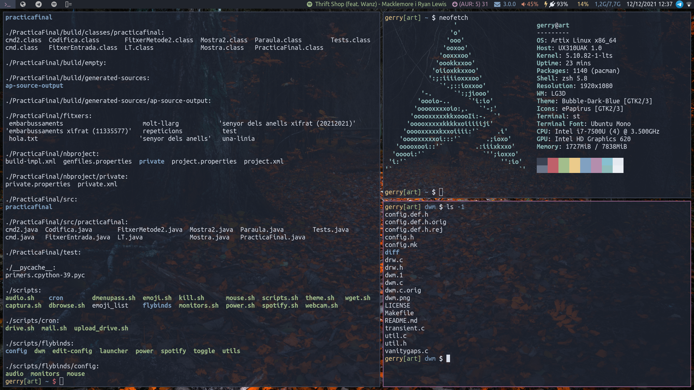

# My build of DWM
You'll find all patches I use in the `diff` folder.

It's integrated with `gcolors` (visit my repo) to make color themes easier.

You will also notice in the *config.h* file that there aren't to much keyboard shortcuts
to setup the computer, as I use `flybinds` (in my repo) to configure it. In DWM when I
press the `¡` key it opens the flybinds program. This it works thanks to **fsignals** patch,
as I can call dwm functions from shell scripts.

To flip the behaviour of `\` key, go to `/usr/share/x11/xkb/symbols/es` and flip `masculine`
for `backslash`. It's pretended to use it with latex so I don't need to press `AltGr`

dwm - dynamic window manager
============================
dwm is an extremely fast, small, and dynamic window manager for X.

Requirements
------------
In order to build dwm you need the Xlib header files.

Installation
------------
Edit config.mk to match your local setup (dwm is installed into
the /usr/local namespace by default).

Afterwards enter the following command to build and install dwm (if
necessary as root):

    make clean install

Running dwm
-----------
Add the following line to your .xinitrc to start dwm using startx:

    exec dwm

In order to connect dwm to a specific display, make sure that
the DISPLAY environment variable is set correctly, e.g.:

    DISPLAY=foo.bar:1 exec dwm

(This will start dwm on display :1 of the host foo.bar.)

In order to display status info in the bar, you can do something
like this in your .xinitrc:

    while xsetroot -name "`date` `uptime | sed 's/.*,//'`"
    do
    	sleep 1
    done &
    exec dwm

Configuration
-------------
The configuration of dwm is done by creating a custom config.h
and (re)compiling the source code.
